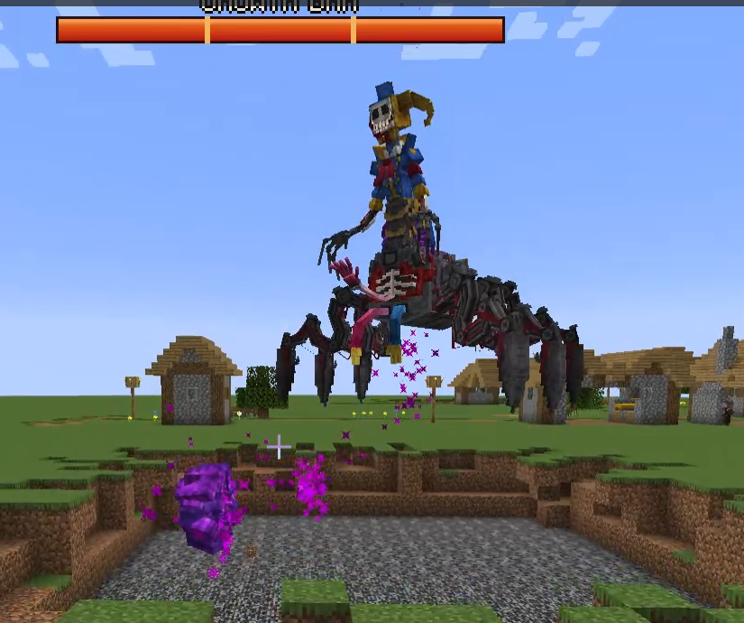
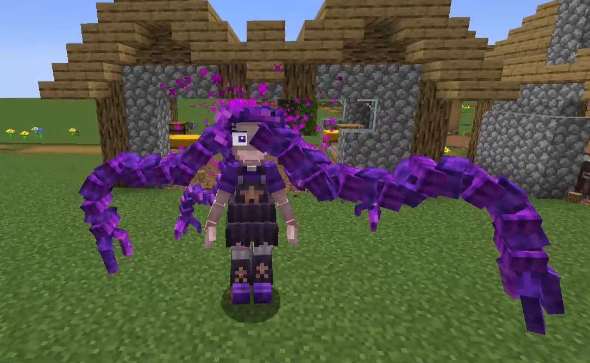
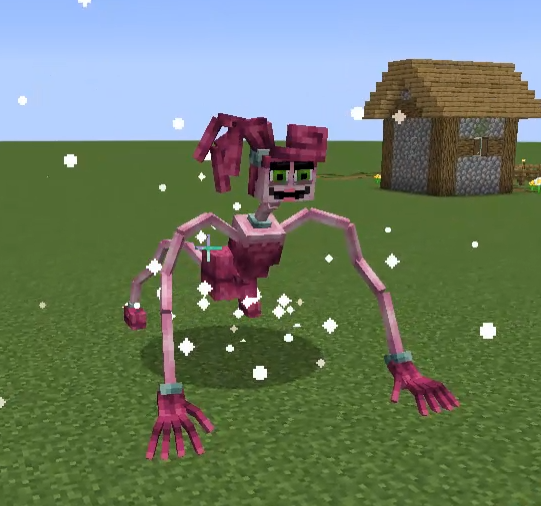

# POPPY PLAYTIME MOD

A horror-themed Minecraft mod inspired by the Poppy Playtime universe, bringing iconic characters, interactive gameplay elements, and roleplay-focused mechanics into Minecraft.

---

## Overview

This project adds a collection of characters and gameplay systems inspired by the Poppy Playtime series while keeping the experience immersive and survival-friendly inside Minecraft.

The mod focuses on atmosphere, interaction, and custom gameplay moments rather than simple mob additions.

---

## Features

- Popular Poppy Playtime inspired characters
- Custom entities and animations
- Horror-themed gameplay mechanics
- Interactive roleplay experiences
- Custom visual effects
- Event-driven gameplay sequences
- Multiplayer-friendly gameplay systems

---

## Gameplay Focus

The mod is designed around creating cinematic and interactive gameplay moments inside Minecraft worlds.

Players can:
- create horror roleplay scenarios
- explore custom encounters
- interact with unique mobs
- build themed adventure experiences
- use gameplay mechanics for storytelling

---

## Technical Notes

Some systems included in the project:

- Custom entity behavior handling
- Gameplay event systems
- Client/server interaction logic
- Custom animation integration
- Modular content structure
- Optimized gameplay processing

---

## Preview

  

  

  

---

## Status

Active project under continuous development and expansion.
